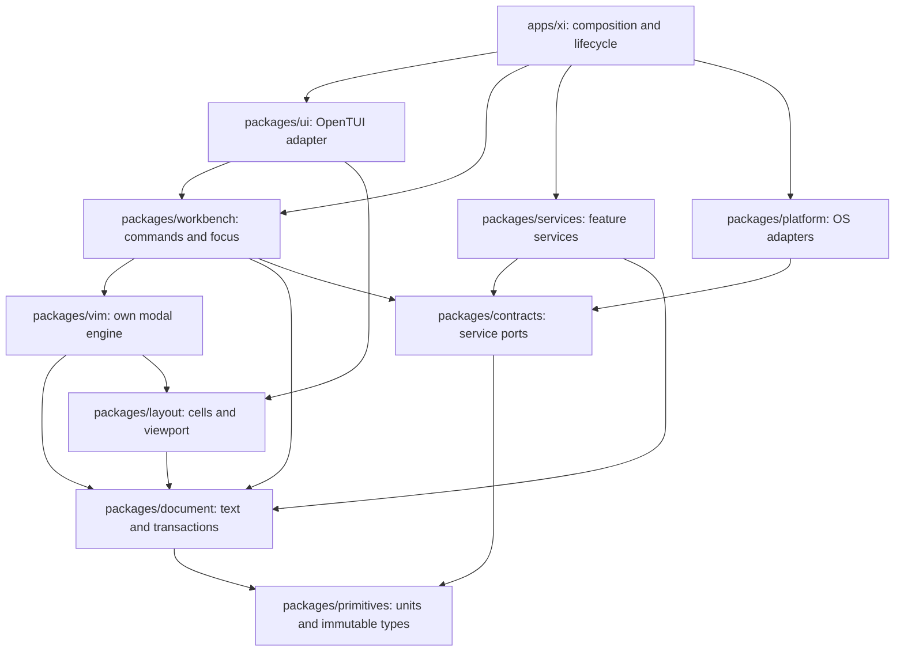

# Architecture and ownership

The architecture has a deterministic editing core, asynchronous services, and a terminal presentation adapter. Performance comes from bounded work and clear ownership, not from calling every package a service. Begin with one Bun application process and a small bounded worker pool. Use subprocesses for tools that already provide efficient protocols (ripgrep, Git, LSP). Add a process or worker only where blocking/CPU isolation is measured to help.

## Package graph



Arrows mean allowed imports, not callbacks that bypass ownership. Service implementations are injected by the composition root; workbench does not import implementation modules. Split `services` into feature directories (language, syntax, search, files, git, formatting, persistence, tasks), each exporting a narrow public entrypoint. Move a feature into a separate workspace package only when it needs independent build/test ownership. Avoid dozens of empty packages.

| Owner | Owns | May request | Must not own |
|---|---|---|---|
| primitives | Branded positions, IDs, clocks and Result types | Nothing effectful | Generic mutable global state |
| document | Piece/rope storage, revisions, anchors, edit journal, undo tree and saved revision | Pure encoding helpers | Key interpretation, filesystem IO, renderer |
| vim | Modes, parser, counts, motions, range normalization, registers, marks, repeat, macros | Document transactions, pure layout; typed effect requests | Disk, network, OpenTUI, LSP transport |
| layout | Wrapping, folds, tab/cell mapping, visible row indexes and cursor projection | Versioned document reads | Text mutation or key handling |
| workbench | Active buffer/view, focus graph, panel visibility, commands, edit coordination | Service ports and engine actions | Protocol parsing, text algorithms |
| UI | OpenTUI renderables, styles, event normalization, cell damage | Read models, dispatch | Mutable document copies, business actions in render callbacks |
| language | LSP transport/client lifecycle, capabilities, request versions, diagnostic/symbol caches | Edit proposals, process port | Direct buffer changes or UI nodes |
| syntax | Incremental parsing, highlight/fold ranges, query versions | Immutable snapshots/deltas | Owning editor semantics |
| search | File index, match streams, dialect/replacement plans | Process/read ports, document snapshots | Direct writes |
| files | Workspace roots, tree metadata, file-operation planning/execution | Platform filesystem and edit coordinator | Inferring filenames from display text without identity |
| git | Repository/index state, porcelain parsing, diffs, stage/commit/history | Process and filesystem ports | Shell interpolation or modifying unsaved buffer text |
| persistence | Save/recovery/session journals, serialization migrations | Document snapshots and platform writes | Independent text history that conflicts with undo |
| platform | Files, processes, watchers, clipboard, clock, terminal capabilities | OS | Product state and Vim semantics |
| apps/xi | Construct, wire, start, stop, CLI parsing | All public entrypoints | Algorithms, feature state, tests' private hooks |

Enforce this graph with import analysis in CI. No cycles, deep imports into another owner's internals, wildcard “utils” dumping ground, global event bus, or hidden service lookup. Cross-feature notifications use typed events scoped to a workspace/document and disposable subscriptions. Every long-lived owner has `dispose()` and lifecycle tests.

## Positions and text

Choose an augmented piece tree provisionally: immutable original chunks, append chunks, balanced nodes with UTF-16 length and line-break aggregates. Avoid whole-string concatenation and array-of-all-lines editing. A rope is acceptable if T004 wins the measured workloads. Record the choice and why, then expose a storage-independent Document interface; do not maintain both implementations indefinitely.

Use zero-based branded `Utf16Offset`, `Utf8ByteOffset`, `LineIndex`, `CellColumn`, `DocumentVersion`, and `RevisionId`. Internal edits use UTF-16 offsets because the owned engine and protocol client are TypeScript; this is an implementation choice, not permission to split surrogate pairs. Vim semantic character advancement must match the oracle, even where a grapheme cluster contains multiple semantic positions. Rendering clusters and terminal cells are separate. Normalized boundaries must never be obtained by naïve `offset + 1` across arbitrary text.

Document stores normalized LF text plus explicit encoding/BOM/EOL metadata. Retain per-line EOL metadata for mixed-EOL preservation or open mixed files with a clearly declared conversion action; do not silently normalize on save. Lossless support is required for accepted editable UTF-8 inputs. Invalid UTF-8 and binary inputs initially open read-only with an explanation and explicit reopen/convert command; preserving raw bytes is mandatory until conversion is accepted. NUL, CRLF, final newline, empty file, and a file containing one newline are distinct fixtures.

Coordinate conversion belongs in one tested module with cached per-line checkpoints. LSP uses the negotiated encoding; UTF-16 is the default only if negotiation selects it. Neovim oracle byte columns are decoded against that checkpoint's actual text. Terminal x coordinates use display cells, never byte or UTF-16 indexes. A tab's width depends on its starting cell; emoji width is terminal-policy dependent. Document snapshots and conversions carry a version; conversions across revisions fail or use explicit anchor transforms.

## Transactions and history

```ts
// Contract sketch; implementation must use opaque validated constructors.
type EditOrigin = 'vim' | 'lsp' | 'formatter' | 'workspace-replace' | 'directory';
interface TextEdit { readonly start: Utf16Offset; readonly end: Utf16Offset; readonly text: string }
interface EditProposal {
  readonly document: DocumentId;
  readonly expectedVersion: DocumentVersion;
  readonly edits: readonly TextEdit[];
  readonly origin: EditOrigin;
  readonly undoGroup: UndoGroupId;
}
```

An edit transaction validates version, range ordering, non-overlap, Unicode boundaries and read-only state before any mutation. Batch ranges refer to one base revision; transform/apply in a documented order. Commit produces a new revision, changed spans, transformed anchors, and one ordered change event. Services receive that committed stream. Editing the same buffer in two views has one history and separate view cursors; undo updates all views from the same revision.

The document owns the undo tree; Vim decides group boundaries and which history operation to request. Each entry retains inverse data or persistent roots, before/after selections, group origin and save identity. Avoid storing entire documents per keystroke. Save state compares revision identity/content policy rather than a Boolean toggled by arbitrary callers. Persistent undo is versioned and corruption-checked.

Vim produces a semantic command outcome: new mode/parser state, cursor intent, transaction(s), and optional effect requests. Services' edits pass through the workbench edit coordinator and document API, never through fake keystrokes. Define whether a service action becomes Vim's dot target: default no; preserve the most recent native repeat target and expose an explicit repeat-service command. Snippet insertion and insert completion need fixtures for undo breaks and ensuing dot behavior.

Cross-file edits are not globally atomic on a normal filesystem. Preflight every file/version, stage reversible data, journal operation steps, and report per-file outcomes if execution fails. Never advertise all-or-nothing persistence unless the platform actually provides it. Do not undo unrelated external changes during rollback. An operation undo checks post-operation versions/hashes before applying inverse edits; conflicts open a recovery review.

## Input, effects and rendering

Input path: terminal bytes → OpenTUI input adapter → canonical key/paste event → focused context dispatcher → Vim engine or widget controller → document commit → dirty read-model update → visible cell render → terminal output. No network or disk awaits are on the ordinary keystroke path. Autopairs, indentation and completion insertion are explicit editing policies with strict-profile fixtures; they do not sit in widget callbacks.

The dispatcher returns exactly one of consumed, pending, or unhandled. A keystroke cannot reach both a panel shortcut and the engine. Pending operator/register/count input belongs to Vim and survives irrelevant service updates. Changing focus uses an explicit transition policy and cancels incompatible pending input visibly. Esc handling separates terminal escape-sequence decoding, Vim mode escape, overlay dismissal, and configured mapping timeout.

Render only visible rows plus small overscan. Cache line layout by document revision segment, width, fold generation and style generation; editing one line cannot invalidate every file or panel. Decorations (selection, diagnostics, search, syntax, semantic tokens, Git) have stable precedence and clipped ranges. Store row/span runs, not one reactive component per character. Repaint on damage and cursor changes; idle state must not drive a permanent 60 Hz loop. Prioritize input/cursor paint above worker result integration.

Background work carries `{workspaceId, documentId?, documentVersion?, requestId, generation}` and cancellation. Limit inbound queues and integrate results in time-bounded batches. Search/diagnostic UI updates may be coalesced; input, text edits and operation acknowledgements may not be dropped. Old generations must not resurrect dismissed UI or overwrite new data. A worker may keep a versioned read replica for parsing, not an independently writable document.

Vim regex/search can be expensive. A search operation can suspend as a typed pending effect over an immutable snapshot with cancellation; Esc cancels and restores pre-search state. Resume only against the expected version or rerun deliberately. Macro and long-command execution is cooperatively sliced while preserving command ordering. “Yielding” must not expose half-applied edits.

## Processes and resilience

Use argv arrays and explicit cwd/env through process ports; Bun supports asynchronous subprocess streams. Bound stderr retention and drain both pipes to avoid deadlocks. Every process gets timeout/cancellation policy, exit reporting and shutdown escalation. Every watcher has event coalescing, overflow recovery and invalidation rules. [Bun subprocesses](https://bun.sh/docs/runtime/child-process), [workers](https://bun.sh/docs/runtime/workers).

On crash or shutdown, restore terminal state in `finally`, stop workers and process groups, flush eligible recovery journals, and dispose renderables. SIGINT is routed according to editing context (native Vim Ctrl-C is not unconditional process exit). SIGTERM requests orderly shutdown with a bounded deadline. Suspend/resume and resize produce a fresh terminal capability/layout pass without losing buffers. Test injected errors at every initialization stage.

## Architectural acceptance

G1 requires an enforced import graph; owner-level contract tests; versioned Unicode-safe transactions; deterministic fake clocks; lifecycle leak checks; and evidence that the UI uses Xi's text model. Any package that needs an exception must provide a concrete dependency/use case and revised diagram before using it. Native optimization may accelerate pure kernels after profiling, but Xi continues to own Vim semantics and no external editor engine is substituted.
